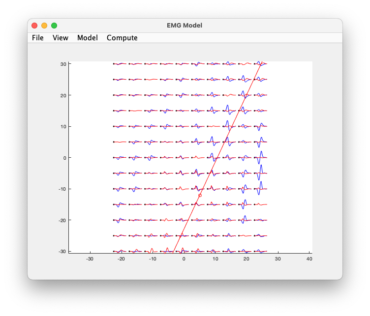

# Halfspace EMG model

This model implements a motor unit with an "infinite halfspace" as volume
conductor, and it can be used to:

- compute the motor unit potential (MUP) with any location or orientation
- to fit the model parameters to a measured (template) motor unit potential

It has a graphical user interface, which should be reasonably self-
explanatory. The program is started by typing "emg_model" at the MATLAB
prompt. To use the model, you need MATLAB 6.0 or later. To perform the
inverse fitting of model parameters, you also need the MATLAB optimization
toolbox.

The functions which drive the actual model are:
 - mu_potential, wich computes the position of the monopoles
 - inf_monopole_potential, which computes the potential on the electrode
   locations

## Copyrights

 Copyright (C) 2002, Robert Oostenveld, Department of Medical Physics, Katholieke Universiteit Nijmegen, NL
 Copyright (C) 2022, Robert Oostenveld, Donders Institute, Radboud University, Nijmegen, NL
